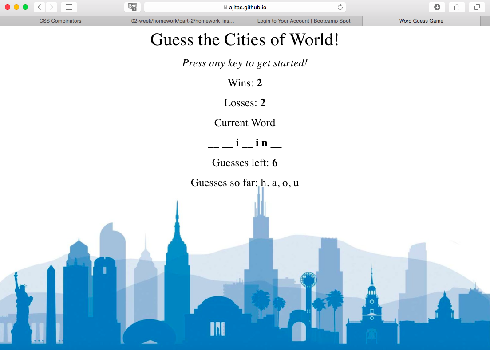

# Word-Guess-Game

<!-- Put a description of what the project is -->
Learning Vanilla Javascript: control structures, data structures, functions, event handling

## Link to deployed site
<!-- make a link to the deployed site --> 
<!-- [What the user will see](the link to the deployed site) -->
[word-guess-game](https://ajitas.github.io/Word-Guess-Game/)

## Images
<!-- take a picture of the image and add it into the readme  -->
<!--  -->


## technology used
<!-- make a list of technology used -->
<!-- what you used for this web app, like html css -->

<!-- 
1. First ordered list item
2. Another item
⋅⋅* Unordered sub-list. 
1. Actual numbers don't matter, just that it's a number
⋅⋅1. Ordered sub-list
4. And another item. 
-->
1. HTML
2. CSS
3. Javascript
    * control structure(loops, conditions)
    * data structures
    * event handling
    * functions


## code snippets
<!-- put snippets of code inside ``` ``` so it will look like code -->
<!-- if you want to put blockquotes use a > -->

```
document.onkeyup = function(event){
    if(event.keyCode >= 65 && event.keyCode <= 90 && arrayInputs.indexOf(event.key.toLowerCase()) == -1){

        userInput = event.key.toLowerCase();
        arrayInputs.push(event.key.toLowerCase());
        var blank = document.getElementById("wordplaceholder");
        var matchFound = false;
        
        for(var i = 0; i < comInput.length; i++){
            if(comInput[i] === userInput){
                totalIndicesFound = totalIndicesFound + 1;
                placeholder[i] = userInput;
                matchFound = true;
            }
        }
        if(matchFound){
            blank.textContent = "";
            for( var i = 0; i < placeholder.length; i++){
                blank.textContent = blank.textContent + placeholder[i] + " ";
            }
            if(totalIndicesFound == placeholder.length) {
                wins++;
                resetGame();
            }
        }
        else{
            guessesLeft--;
            document.getElementById("guessesleft").textContent = guessesLeft;
            if(guessesLeft == 0){
                losses++;
                resetGame();
            }
            else{
                if(document.getElementById("guesses").textContent == ""){
                    document.getElementById("guesses").textContent = event.key.toLowerCase();
                }
                else{
                    document.getElementById("guesses").textContent = document.getElementById("guesses").textContent  + ', ' + event.key.toLowerCase();
                }
            }
        }
        document.getElementById("wins").textContent = wins;
        document.getElementById("losses").textContent = losses;
    }
    else
    {
        if(event.keyCode < 65 && event.keyCode > 90)
            alert("Invalid input");
    }
}
```
## Learning points
* How key events are handled in javascript
* How to use the event keys by logging it
* Script that uses DOM should not be run before DOM is loaded
* Returning functions


## Author 
[Ajita Srivastava](https://github.com/ajitas)

## License
Standard MIT License